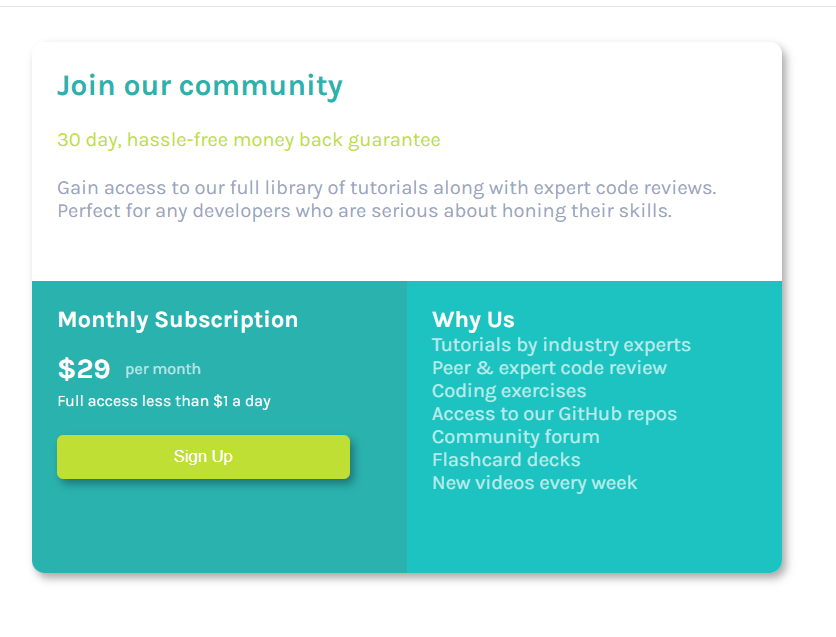

# Frontend Mentor - Single price grid component solution

This is a solution to the [Single price grid component challenge on Frontend Mentor](https://www.frontendmentor.io/challenges/single-price-grid-component-5ce41129d0ff452fec5abbbc). Frontend Mentor challenges help you improve your coding skills by building realistic projects. 

## Table of contents

- [Overview](#overview)
  - [The challenge](#the-challenge)
  - [Screenshot](#screenshot)
  - [Links](#links)
- [My process](#my-process)
  - [Built with](#built-with)
  - [What I learned](#what-i-learned)
  - [Continued development](#continued-development)
  - [Useful resources](#useful-resources)
- [Author](#author)
- [Acknowledgments](#acknowledgments)

**Note: Delete this note and update the table of contents based on what sections you keep.**

## Overview

### The challenge

Users should be able to:

- View the optimal layout for the component depending on their device's screen size
- See a hover state on desktop for the Sign Up call-to-action

### Screenshot



### Links

- Solution URL: [Mayank's Single Price Component](https://github.com/Mayank926/single-price-component)
- Live Site URL: [Add live site URL here](https://your-live-site-url.com)

## My process

### Built with

- Semantic HTML5 markup
- CSS custom properties

### What I learned

- Using margin in css to provide proper spacing in between elements
- Using display style inline-block on div, providing curved corners, using vertical align
```css
 #ftrLeft {
    padding: 20px;
    display: inline-block;
    width : 50%;
    height:100%;
    vertical-align: top;
    background-color : #2AB2AF;
    border-bottom-left-radius: 10px;
  }
```
- removing bullet points in list items
```css
  li {
    list-style-type: none;
    padding: 0;
    margin: 0;
    opacity: 0.7;
  }
```

- Using box sizing border-box at root element and inheriting to whole document
```css
  html {
    box-sizing : border-box;
    font-family : 'Karla';
    font-size : 16px;
    font-weight: 400;
  }

  *, *:before, *:after {
    box-sizing: inherit;
  }
```
- Using box shadow , and generating shadow box online

```css
 #mainContainer {
    width : 600px;
    height : 425px;
    border-top-left-radius: 10px;
    border-top-right-radius: 10px;
    border-bottom-left-radius: 10px;
    border-bottom-right-radius: 10px;
    box-shadow: 3px 4px 7px 0px rgba(0,0,0,0.34);
  }
```
- Using relative position - did not understand fully though
```css
  #perMonth {
    display : inline-block;
    font-size: 0.8rem;
    position: relative;
    top : -3px;
    left : 8px;
    opacity: 0.7;
  }
```
- Using relative fornt size
```css
  #fullAcc {
    font-size: 0.8rem;
  }
```
- Using rel type preconnect for eager loading of resources and rel type stylesheet
```html
<head>
<link rel="preconnect" href="https://fonts.googleapis.com">
<link rel="preconnect" href="https://fonts.gstatic.com" crossorigin>
<link href="https://fonts.googleapis.com/css2?family=Karla:ital,wght@0,200..800;1,200..800&display=swap" rel="stylesheet">
<link rel="stylesheet" href="style.css"> <!-- Link to your style.css file -->
  
</head>

```

### Continued development

- Practise more of static websites to get better hold on html and css
- Do the same exercise after learning react


- [Free Code Camp Org HTML CSS Javascript tutorial](https://www.youtube.com/watch?v=zJSY8tbf_ys&t=61416s) - I am following this tutorial to start my html css javascript journey.
